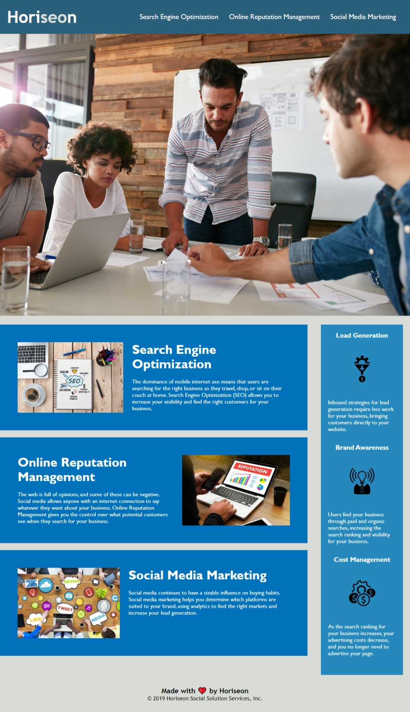

# 01-code-refactor
Homework #01 Refactoring to Increase Accessibility

This is my first homework file.

I tried to eliminate the usage of div tags to make the html more readable, and choose the semantic element that reflects their actual usage in the document.

I added alt attributes for the image.  Note, I didn't do this for the background image in the CSS file. I wasn't sure whether than should be moved
to the html file or not.  Ultimately I chose to leave it where it was.

Also in the HTML file, I tried to avoid unnecessary use of classes and id's (for example, the replacing the tag div class="header" with the header tag.

In the CSS file, I tried as much as possible to eliminate redundant style definitions.

I tried to document the changes I made as much as possible.

The following is a screenshot of my final index.html:

This is a 
[link to html code](index.html)

This is a 
[link to deployed page](https://brianhaney2020.github.io/01-code-refactor/)

